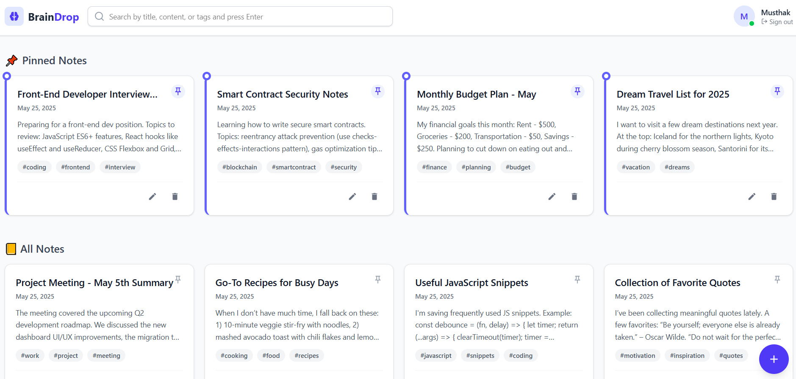

# 🧠 BrainDrop – Your Minimalist Note Companion

 

**BrainDrop** is a lightweight, distraction-free note-taking app built with the MERN stack. Designed for speed and simplicity, BrainDrop helps users capture and organize thoughts effortlessly — whether it's quick ideas or structured tasks.

> “Just open, write, and focus. BrainDrop takes care of the rest.”

---

## 🚀 Live Demo

🌐 [View the Live App](https://your-vercel-url.vercel.app) 
---

## 🛠️ Tech Stack

### 🔹 Frontend
- [React 19](https://react.dev/)
- [Tailwind CSS 4](https://tailwindcss.com/)
- [Framer Motion](https://www.framer.com/motion/)
- [React Router DOM 7](https://reactrouter.com/)
- [Axios](https://axios-http.com/)
- [Moment.js](https://momentjs.com/)
- [React Modal](https://github.com/reactjs/react-modal)
- [React Icons](https://react-icons.github.io/react-icons/)

### 🔹 Backend
- [Express 5](https://expressjs.com/)
- [MongoDB + Mongoose](https://mongoosejs.com/)
- [JWT (jsonwebtoken)](https://www.npmjs.com/package/jsonwebtoken)
- [dotenv](https://www.npmjs.com/package/dotenv)
- [cors](https://www.npmjs.com/package/cors)
- [nodemon](https://nodemon.io/)

---

## ✨ Features

- 📝 Real-Time Editing
- 💾 Auto-Save Notes
- 🔐 JWT Authentication
- 📱 Mobile-Responsive UI
- 🎨 Smooth Animations
- ☁️ MongoDB Cloud Storage

---

